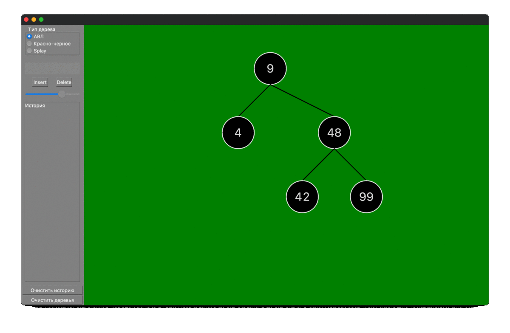

### Визуализатор бинарных деревьев поиска

+ АВЛ, красно-черное, Splay
+ Масштабирование
+ Логарифмическая шкала масштабирования

#### Сборка:

Минимальная версия Qt, на которой проект был проверен:  5.11.3

Удобным для вас спомобом передайте cmake ключ содержаший путь до Qt:

`-DCMAKE_PREFIX_PATH=/YOUR_QT_PATH/Qt/YOUR_QT_VERSION/clang_64/lib/cmake`

Рекомендую использовать CLion для сборки

Известные проблемы:

+ Случайные баги при масшабировании

+ При управлении с тачпада ползунок мастабирования случайным образом отскакивает от краёв

+ Нахлёст некоторых элементов при использовании различных версий Qt 